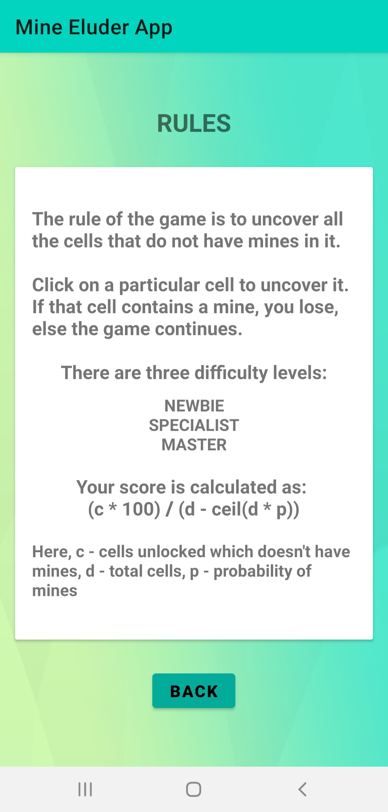
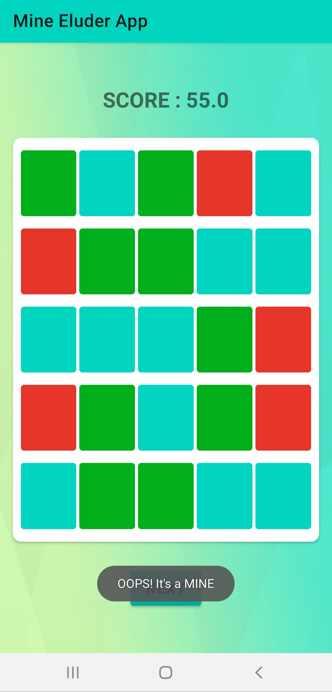
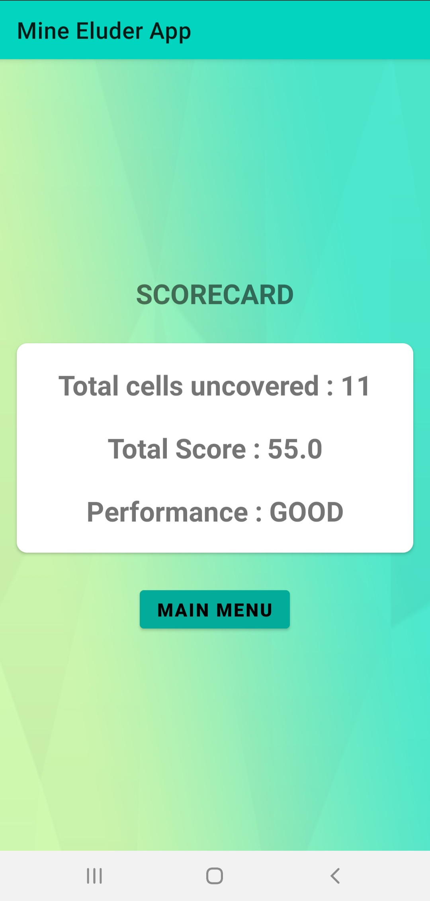
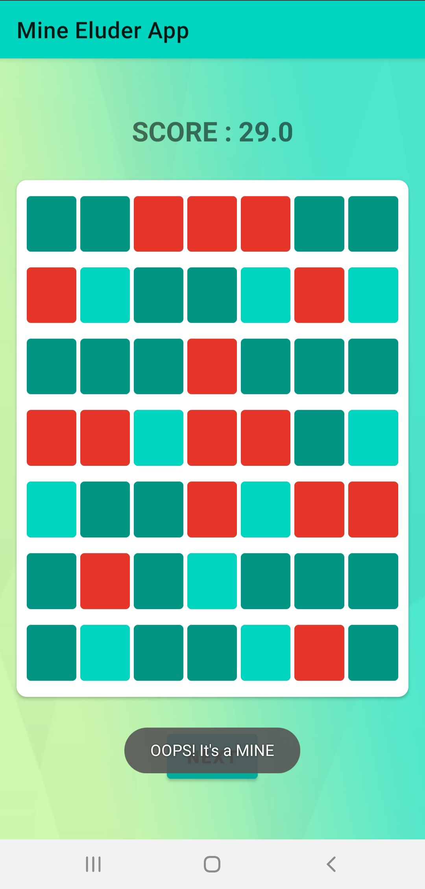
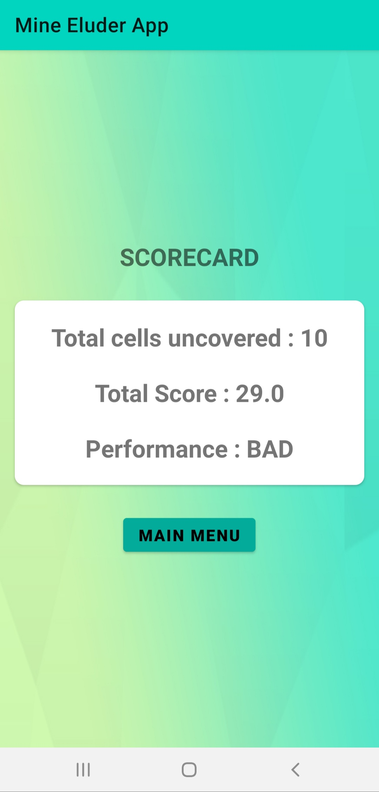
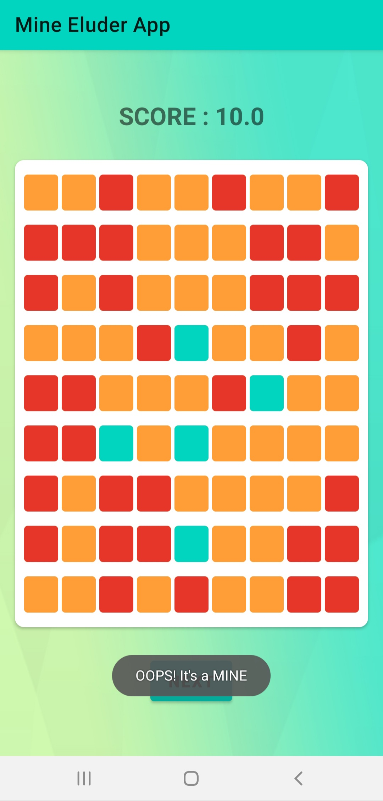
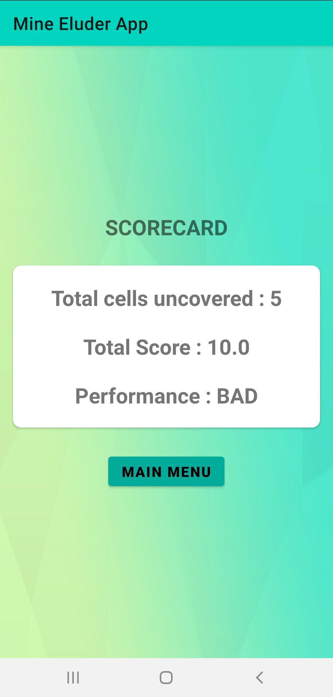

# Mine-Eluder-App
A simple game app using TextViews, EditTexts, Buttons and Intents. This app is an upgradation to the command-line game "Mine-Eluder" which I developed using C++.

## Intro about the Game
`Mine Eluder` is a `2-D grid` based game with some cells having obstacles. Initially all the cells are covered. 
The goal of the game is to uncover all the possible cells that do not have obstacles. 
The player can step into any location inside the grid and uncover it. 
The obstacles are called as `mines`, where the player should not step into, if he steps into the mine and uncovers it, then the game ends there. 
There are three difficulty levels in this game, `Newbie`, `Specialist` and `Master`. 
The `dimension` of grid and `probability` of mines is determined according to the `difficulty level`.  
  
## Rules of the Game
1. The rule of the game is to uncover all the cells that do not have `mines` in it.
2. To uncover any cell you may enter the cell location. If the cell you entered has mine it in, then you lose the game, else the game continues.
3. You can choose the difficulty of the game. There are three difficulty options available. They are
   
      - `NEWBIE`
      - `SPECIALIST`
      - `MASTER`
      
4. Colours used and its meaning 

      -  `NEWBIE`
      -  `SPECIALIST`
      -  `MASTER`
      -  `Cell is uncovered`
      -  `Mine`
    
## Configuration of the Grid
#### 1. Dimension of the Grid
<table>
  <tr>
    <td> NEWBIE </td> 
    <td> 5*5 </td> 
    <td> (Total 25 cells) </td>
  </tr>
  <tr>
    <td> SPECIALIST </td> 
    <td> 7*7 </td> 
    <td> (Total 49 cells) </td>
  </tr>
  <tr>
    <td> MASTER </td> 
    <td> 9*9 </td> 
    <td> (Total 81 cells) </td>
  </tr>
</table>

#### 2. Probability of Mines
<table>
  <tr>
    <td> NEWBIE </td> 
    <td> 0.20 </td> 
    <td> (Total 5 mines in 25 cells) </td>
  </tr>
  <tr>
    <td> SPECIALIST </td> 
    <td> 0.30 </td> 
    <td> (Total 15 mines in 49 cells) </td>
  </tr>
  <tr>
    <td> MASTER </td> 
    <td> 0.40 </td> 
    <td> (Total 33 mines in 81 cells) </td>
  </tr>
</table>

## Scoring
Your score is calculated as: **`(c * 100) / (d - ceil(d * p))`**
 - Here, 
    - `c` - cells unlocked which doesn't have mines
    - `d` - total cells
    - `p` - probability of mines

## Approach Used
The grid is implemented as a `Sparse Matrix` where `mines` are the `non-zero` elements and `other cells` are the `zero` elements. This Sparse Matrix is represented in memory using `2-D ArrayList` based on `coordinate list` method where row and column of mines location is stored. This thereby saves `^((1 - 2 * p) * 100)%` of memory. The locations of non-zero elements in the Sparse Matrix is filled using the `random` function present in the `Kotlin Random Class`.

^ `(p - probability of mines)` -> the `result` is `approximate` value

## Screenshots of the App
<table>
  <tr>
    <td>  </td>
    <td>  </td>
    <td>  </td>
  </tr>
  <tr>
    <td>  </td>
    <td>  </td>
    <td>  </td>
  </tr>
  <tr>
    <td>  </td>
    <td>  </td>
    <td>  </td>
  </tr>
</table>

**_Note:_ I developed this game using C++ which is a command-line application and this app is an upgradation to it with a good UI. You can find the C++ code here :point_right: [Click Here](https://github.com/kiruba-r11/Mine-Eluder)**

